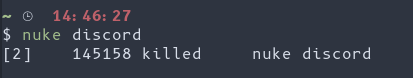
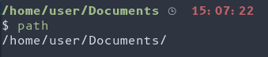
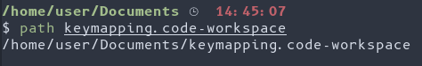
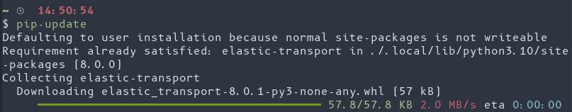
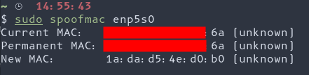
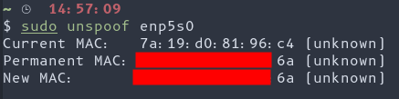
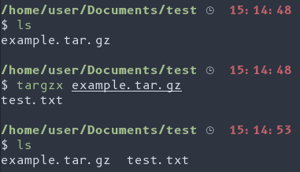
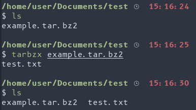
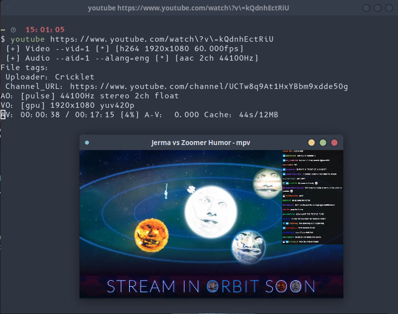

# Shell Scripts
collection of shell scripts I use on my computer
 
put them in /bin/ or /usr/bin or wherever you want to as long as it's in PATH

## nuke
sends SIGKILL to all processes with the name you put in as an arg.
 
this is called nuke because it nukes them. All of them. Even itself lol

### requirements
 * none

### usage

`nuke <process>`

## path
like `pwd` but you can put a filename in as an argument to get the full path to that file

### requirements
 * none

### usage

`path` 

`path <filename>`

## pip-update
updates all out-of-date python packages with pip. might hang for a bit because `pip list -o` takes some time to list outdated packages

### usage
`pip-update`

## spoofmac
uses macchanger to spoof mac address

### requirements
 * systemd
 * NetworkManager
 * macchanger

### usage

`spoofmac <interface>`

## unspoof
uses macchanger to unspoof your mac address, i.e. set it back to the real one

### requirements
 * systemd
 * NetworkManager
 * macchanger

### usage

`spoofmac <interface>`

## targzx
uses `tar` to extract contents of `.tar.gz` into current directory 

### requirements
 * none

### usage

`targzx <filename>`

## tarbzx
uses `tar` to extract contents of `.tar.bz2` into current directory 

### requirements
 * none

### usage

`tarbzx <filename>`

## youtube
play youtube videos in best quality with mpv

### requirements
 * mpv
 * youtube-dl
   * yt-dlp seems to work a LOT better

### usage

`youtube <link>`

(video resized to fit in my terminal window)
